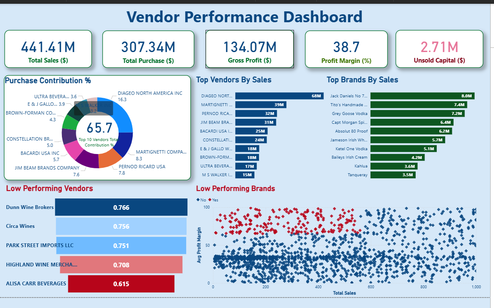

# Vendor Performance Analysis & Profitability Dashboard

## Project Overview
This project analyzes vendor and brand performance to evaluate sales contribution, profitability, and inventory efficiency.  
The goal is to help business stakeholders identify top-performing vendors, detect low-performing suppliers and brands, and uncover opportunities to improve profit margins and reduce unsold capital.

The project combines data analysis with an interactive Power BI dashboard to deliver actionable, business-focused insights.

---

## Business Problem
Businesses working with multiple vendors often face challenges such as:
- Over-reliance on a small group of vendors
- Low-performing vendors consuming working capital
- Unsold inventory impacting cash flow
- Difficulty identifying high-sales but low-margin brands

This analysis aims to support procurement, finance, and strategy teams in making data-driven decisions.

---

## Key Objectives
- Analyze total sales, purchases, and gross profit across vendors
- Identify top vendors and brands by sales contribution
- Detect low-performing vendors and brands based on profitability
- Evaluate unsold capital tied up in inventory
- Compare vendor performance using profit margin and sales volume

---

## Tools & Technologies Used
- Python (Pandas, NumPy)
- SQL (data aggregation and joins)
- Power BI (dashboarding and visualization)
- Excel (initial data review)
- Jupyter Notebook (EDA and analysis)

---

## Dataset Overview
The dataset contains transactional and vendor-level information, including:
- Vendor details
- Brand information
- Purchase and sales values
- Quantity sold
- Gross profit and profit margins
- Unsold inventory value

---

## Exploratory Data Analysis (EDA)
Key analysis performed:
- Vendor-wise sales and purchase distribution
- Gross profit and profit margin calculation
- Vendor contribution analysis
- Brand-level sales performance
- Identification of low-performing vendors and brands
- Detection of inventory inefficiencies

EDA helped validate data quality and guided dashboard design.

---

## Dashboard Overview
The Power BI dashboard provides a comprehensive view of vendor performance:

### Key Metrics
- Total Sales
- Total Purchase
- Gross Profit
- Profit Margin Percentage
- Unsold Capital

### Visual Analysis
- Purchase contribution percentage by vendors
- Top vendors by sales
- Top brands by sales
- Low-performing vendors ranking
- Low-performing brands scatter analysis (Sales vs Profit Margin)
- Relationship between sales volume and profitability

---

## Key Insights
- A small group of top vendors contributes a majority of total purchases and sales
- Several vendors show low profit margins despite moderate sales
- Unsold capital highlights inventory optimization opportunities
- Some brands generate high sales but operate at lower margins
- Vendor diversification could reduce dependency risk

---

## Business Recommendations
- Re-evaluate contracts with low-performing vendors
- Optimize inventory levels to reduce unsold capital
- Focus marketing and procurement efforts on high-margin brands
- Diversify vendor base to reduce concentration risk
- Use profit margin, not just sales, as a performance metric

---

